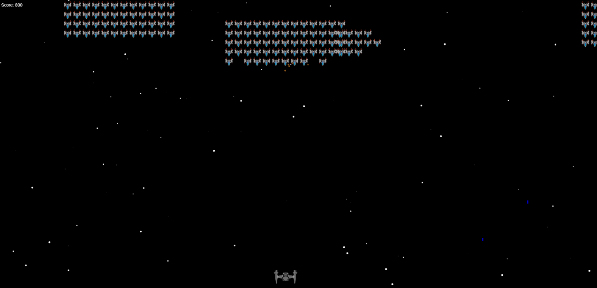

# 👾 Space_Invaders: Star Wars Edition 👾

## Introduction 🚀
Welcome to the Space Invaders: Star Wars Edition repository! This project features a thrilling game that combines Space Invaders gameplay with the iconic Star Wars universe. Built using JavaScript and HTML Canvas, it offers an immersive gaming experience.

## Gameplay 🌌
Take control of a starship and eliminate waves of invading foes. Use W,A,S,D keys to move and spacebar to fire lasers. Defeat enemies and protect the galaxy!

## How to Play 🎮
1. [Click here](https://tigscript.github.io/Space_Invaders/) or the image below to launch the game.
   
   

2. Use arrow keys to move.
3. Press spacebar to fire lasers.
4. Eliminate all invaders to win!

